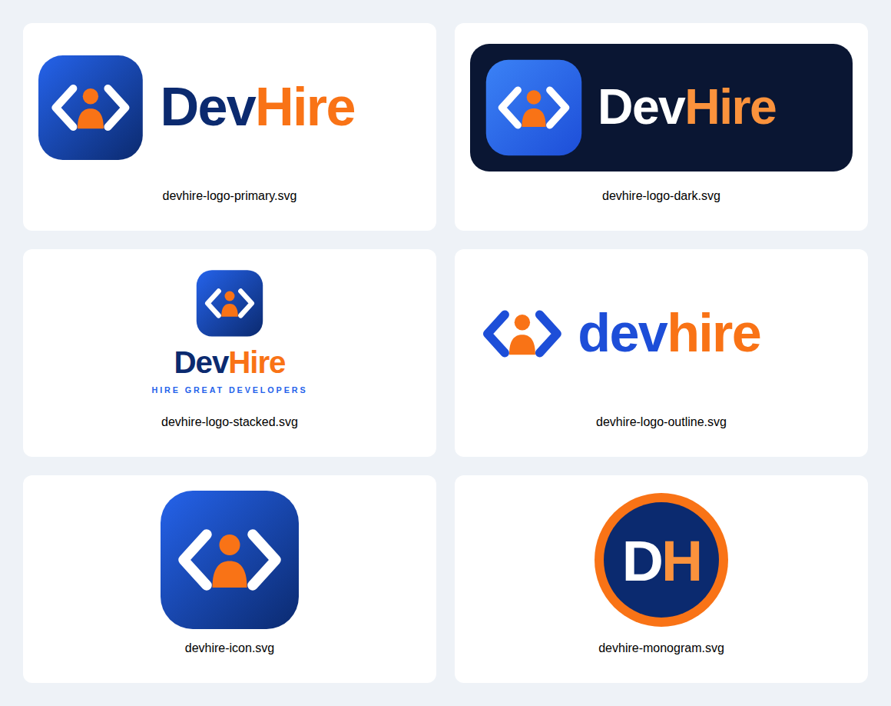

# DevHire Logo Kit

Theme: **Blue** `#2563EB` → `#0B2A6F` · **Orange** `#F97316` / `#FB923C` · Dark bg `#0A1633`

The mark is a person inside code brackets `< 👤 >`: developers + hiring.

| File | Use |
|------|-----|
| `devhire-logo-primary` | Main horizontal logo on light backgrounds |
| `devhire-logo-dark` | Horizontal logo on dark backgrounds |
| `devhire-logo-stacked` | Vertical logo with tagline (posters, splash screens) |
| `devhire-logo-outline` | Minimal, no-background version (headers, docs) |
| `devhire-icon` | App icon / favicon / social avatar |
| `devhire-monogram` | "DH" circular badge |

Every variant is provided as scalable `.svg` plus a `.png` export.
Wordmark font: Poppins ExtraBold (falls back to Montserrat / Segoe UI / Arial).
